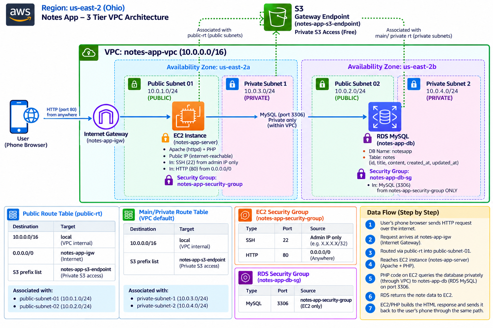
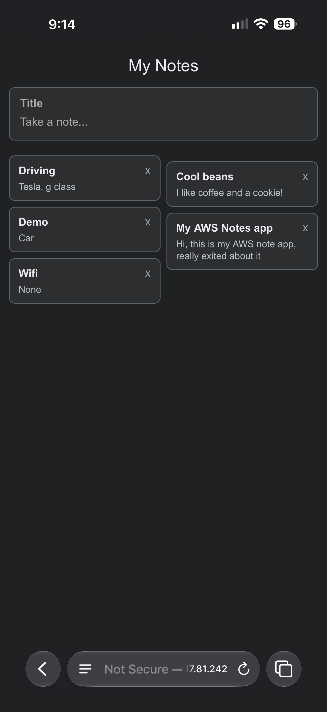

# AWS Notes App

A Google Keep - style notes app built on a real 3-tier AWS architecture - VPC, EC2, and RDS - created as a hands-on learning project to understand how production cloud infrastructure actually works.

## Architecture

## Overview

This project implements a complete 3-tier architecture on AWS:

- **Network tier**: Custom VPC with public and private subnets across 2 Availability Zones
- **Application tier**: EC2 instance running Apache + PHP in a public subnet
- **Data tier**: RDS MySQL database in private subnets, with no direct internet access

## Infrastructure Details

### VPC
- Name: `notes-app-vpc`
- CIDR: `10.0.0.0/16`
- Region: `us-east-2` (Ohio)

### Subnets
| Subnet | CIDR | AZ | Type |
|---|---|---|---|
| public-subnet-01 | 10.0.1.0/24 | us-east-2a | Public |
| private-subnet-1 | 10.0.3.0/24 | us-east-2a | Private |
| public-subnet-02 | 10.0.2.0/24 | us-east-2b | Public |
| private-subnet-2 | 10.0.4.0/24 | us-east-2b | Private |

### Networking
- **Internet Gateway** (`notes-app-igw`) attached to the VPC for public subnet internet access
- **Public Route Table** (`public-rt`): routes `0.0.0.0/0` -> Internet Gateway, associated with both public subnets
- **Private Route Table** (VPC default): no internet route -- private subnets stay fully isolated
- **S3 Gateway Endpoint** (`notes-app-s3-endpoint`): free, private route to S3 from both route tables, no NAT Gateway required

### Compute (EC2)
- Instance: `notes-app-server` in `public-subnet-01`
- Apache (httpd) + PHP
- Security Group `notes-app-security-group`:
  - SSH (22) -- restricted to admin IP only
  - HTTP (80) -- open to all (public web access)

### Database (RDS)
- Instance: `notes-app-db` (MySQL)
- Spans `private-subnet-1` and `private-subnet-2` via DB Subnet Group
- **Public access: disabled** -- unreachable from the internet
- Security Group `notes-app-db-sg`: allows MySQL (3306) **only** from `notes-app-security-group` -- not from any IP address
- Database: `notesapp`, table: `notes` (id, title, content, created_at, updated_at)

## Data Flow

1. User's phone browser sends an HTTP request
2. Request hits the Internet Gateway, routed into the public subnet
3. EC2 instance (Apache + PHP) handles the request
4. PHP queries the RDS database privately over the internal VPC network
5. RDS returns the data to EC2
6. EC2 renders the response and sends it back to the user

## Security Practices Applied

- Database has zero public internet exposure -- reachable only from the application server
- Security groups reference other security groups (not IP ranges) for internal traffic -- tightly scoped access
- SSH access restricted to a single known IP, not open to the world
- Secrets (database credentials) are kept out of version control (see `.gitignore`)

## Tech Stack

- **Infrastructure**: AWS VPC, EC2, RDS, S3 Gateway Endpoint
- **Backend**: PHP, MySQL
- **Frontend**: Vanilla HTML/CSS/JS (no frameworks)

## Status

Personal learning project built.

## Screenshot

